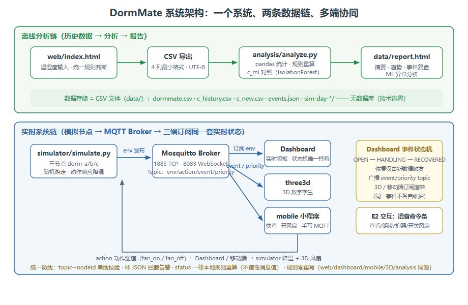
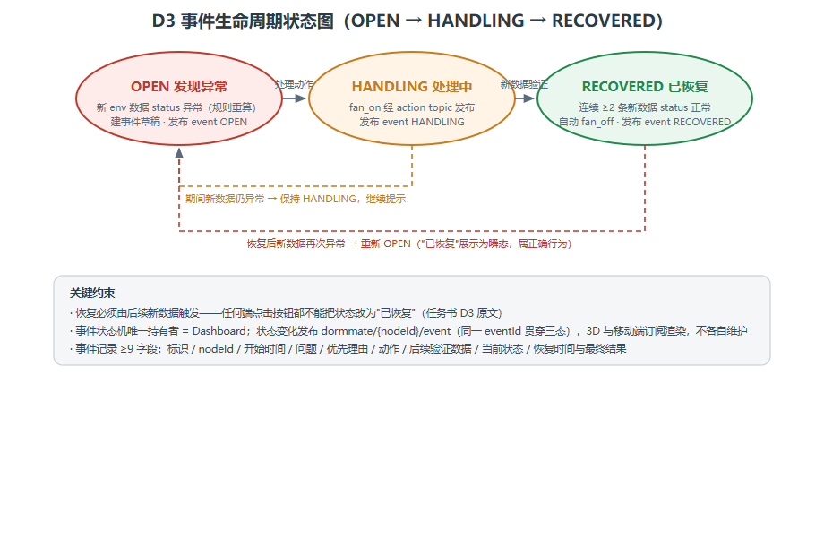
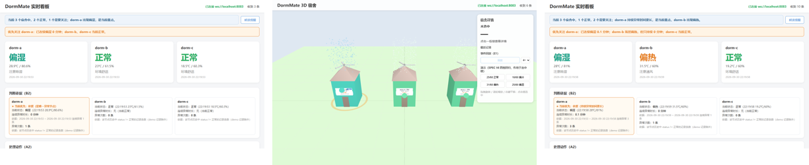
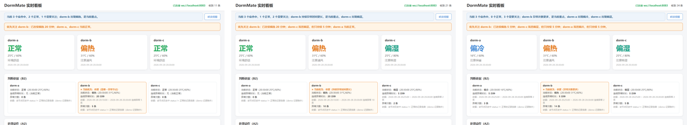
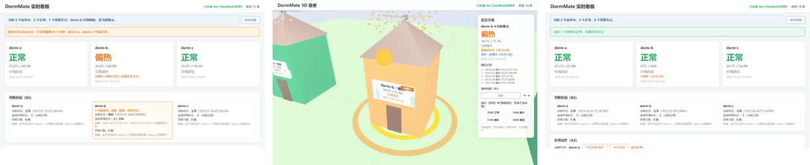
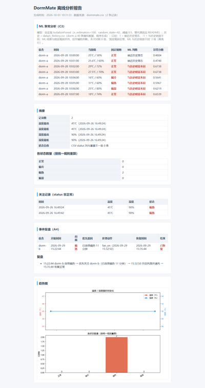

# DormMate 技术文档（V0.8R5 综合作品）

> 版本：V0.8R5 ｜ 日期：2026-10 ｜ 对应任务书：《C01_DormMate_02_综合作品任务书_V0.8R5.pdf》
> 本文档按任务书 p21 建议的六部分组织：项目概述 / 系统与数据链 / 核心机制 / D1-D5 与 E1-E3 关键实现 / 测试与验证 / 自主设计与 Open Enhancement。代码只引用关键片段（≤15 行），不整段复制。

---

## 1 项目概述

### 1.1 项目目标

DormMate 是一个宿舍环境助手：把温湿度数据从"单条记录判断"升级为"多宿舍持续监测的完整系统"。目标不是做一个温湿度计，而是回答宿舍管理的四个连续问题——**现在该看谁、怎么处理、处理完怎么验证、事后怎么复盘**——并用一个系统闭环回答它们。

### 1.2 使用场景

- **实时盯屏**：宿舍管理员（如宿管）打开 Dashboard，三间宿舍的状态实时刷新，出现异常时顶部横幅直接给出"优先关注谁"及理由，3D 场景一眼定位是哪栋楼，移动端随身快查。
- **现场处理**：对异常宿舍执行"开启风扇/通风"（Dashboard 或移动端操作），系统记录处理过程，并在后续新数据连续正常后自动判定"已恢复"、自动关扇。
- **事后复盘**：Web 页积累的历史 CSV 由 Python 离线分析生成报告（摘要、趋势、事件复盘、ML 异常分析），可回看、可归档。
- **演示与教学**：模拟节点随机游走 + 预设序列 + 故障注入，可反复复现同一条事件闭环。

### 1.3 核心问题（为什么这样设计）

1. **多节点时"先看谁"**：单宿舍只需要判断一条记录；三间宿舍同时异常时，需要可解释的优先级——本项目用"连续异常时长 → 异常次数 → nodeId 顺序"的程序化规则（D2）。
2. **"已恢复"谁说了算**：不能由人点按钮决定恢复——恢复必须由后续新数据触发，否则处理记录会失真（D3）。
3. **多端一致从哪来**：Web/移动端/3D 围绕同一套实时状态，必须有一个唯一状态源，而不是各端各自维护一份"看起来一样"的状态（E3/D3）。
4. **固定规则的边界在哪**：阈值规则（18/30/75）能判断"异常"，但发现不了"与历史常态不同"的微妙偏离——引入一次轻量 ML 应用做辅助判断，并诚实保留它的不理想案例（D5）。

---

## 2 系统与数据链

### 2.1 整体架构

一个系统由两条数据链组成：**离线分析链**（历史数据 → 分析 → 报告）与**实时系统链**（模拟节点 → MQTT → 三端订阅）。两条链共用同一套状态规则与数据约定，通过 `data/` 下的 CSV 与 events.json 衔接（实时链的事件导出后进入离线链的报告复盘）。



*图 1 系统架构：一个系统、两条数据链、多端协同*

### 2.2 离线分析链

```
web/index.html（表单输入）→ CSV 导出（data/*.csv）→ analysis/analyze.py → data/report.html
```

- **入口** `web/index.html`：温湿度输入 → 校验（空值/非数字/超范围拦截，不进入分析、不追加历史）→ 统一规则 → 状态 + 建议 + 带时间历史。历史仅存内存，导出 CSV 落盘。
- **分析** `analysis/analyze.py`：自动选择 `data/` 中最新 CSV，用统一规则重算每条记录（不信任 CSV 里的 status 列，输出"状态自查"），统计记录数、温湿度最高最低、各状态数量、关注记录，生成 `trend.png` 与 `report.html`。支持 `--watch`（放入新 CSV 自动重跑）、`--selftest`（回归自测）。
- **报告** `report.html` 五个区块：ML 异常分析（C3）/ 摘要 / 关注记录 / 事件复盘（A4，读 events.json）/ 趋势图。C 组 ML 对照结果经 `c_compare.json` 接回。

### 2.3 实时系统链

```
simulator/simulate.py（三节点）→ Mosquitto（1883/8083）→ Dashboard + three3d + mobile
                                        ↑ action / event / priority（Dashboard 状态机广播）
```

- **模拟节点** `simulator/simulate.py`：dorm-a/b/c 三线程随机游走，约每 2.5 秒一批经 `dormmate/{nodeId}/env` 发布统一 JSON；订阅 `dormmate/+/action`，收到 fan_on 后对该节点模拟降温趋势，fan_off 恢复随机游走。
- **Broker**：本机 Mosquitto，1883 TCP（Python/paho 与移动端以外的工具）+ 8083 WebSocket（浏览器三端与小程序）。
- **三端**：Dashboard 实时看板（事件状态机唯一持有者）、three3d 数字孪生（空间表达）、mobile 小程序（快查快操作）——订阅同一批 topic，状态一律本地规则重算。

---

## 3 核心机制

### 3.1 统一数据结构与规则（零重写约定）

全项目统一的 JSON 六字段（SPEC §4）：

```json
{"nodeId": "dorm-b", "temperature": 29.0, "humidity": 72.0, "status": "正常", "time": "2026-09-28 10:03:00", "action": ""}
```

- `status` 必须由统一规则计算、禁止手填；顺序固定：`temperature < 18 → 偏冷`；`temperature >= 30 → 偏热`；`humidity >= 75 → 偏湿`；其余 → 正常。
- 规则的实现只有一处权威代码（`web/script.js` 的 `computeStatus` / `analysis/analyze.py` 的 `compute_status` / `mobile/utils/rules.js` 同源移植），**各端一律本地重算、不信任消息里的 status 值**——这是防串线、防篡改的第一道防线。
- CSV 最小格式：`time,temperature,humidity,status`，UTF-8（带 BOM 兼容）。

### 3.2 Topic 设计与 MQTT 过程

| Topic | 方向 | Payload 要点 |
|---|---|---|
| `dormmate/{nodeId}/env` | simulator → 三端 | 统一 JSON 六字段；`action` 字段写当前动作值 |
| `dormmate/{nodeId}/action` | Dashboard/移动端 → simulator、3D | `{nodeId, action: "fan_on"\|"fan_off", actionTime}` |
| `dormmate/{nodeId}/event` | Dashboard → 移动端、3D | `{nodeId, eventId, state: "OPEN"\|"HANDLING"\|"RECOVERED", time, summary}` |
| `dormmate/priority` | Dashboard → 移动端、3D | `{nodeId, reason, time}`（nodeId 空串 = 无重点） |

校验链（Dashboard、3D、simulator 三处同款思路）：topic 格式 → JSON 容错 → 对象守卫 → 六字段齐全 → 温湿度范围 → **topic 第二段与 payload.nodeId 一致（串线防线）**；任何一环失败即丢弃并计数告警。Broker 重启后各端自动重连。核心防线摘录（dashboard/app.js，全项目同款）：

```js
// 串线防线：topic dormmate/{nodeId}/env 的 nodeId 必须与消息 JSON 的 nodeId 一致
const topicNode = topic.split("/")[1];
if (!payload || payload.nodeId !== topicNode) {
    return reject("nodeId 与 topic 不符或缺失");      // 丢弃并告警
}
if (!NODE_IDS.includes(payload.nodeId)) return reject("未知节点");
const t = Number(payload.temperature), h = Number(payload.humidity);
if (!isFinite(t) || t < -50 || t > 50) return reject("温度非法");
if (!isFinite(h) || h < 0 || h > 100)  return reject("湿度非法");
const status = computeStatus(t, h);                   // 本地重算，不信任消息 status
```

**移动端手写极简 MQTT 3.1.1 客户端**（`mobile/utils/mqtt.js`，零依赖，不引入 npm 构建）：`wx.connectSocket` 连 `ws://127.0.0.1:8083`，按协议手写帧——CONNECT（固定头 `0x10`，协议名 `MQTT` + 协议级 `0x04` + 连接标志 `0x02` + KeepAlive 30s + ClientId）、SUBSCRIBE（`0x82` + PacketId + Topic Filter + QoS 0）、PINGREQ（`0xC0`，保活）与 PINGRESP（`0xD0`）处理、PUBLISH（`0x30`，供动作按钮）；解析 CONNACK（`0x20`，成功后发 SUBSCRIBE）、PUBLISH（按 topic 分流）、SUBACK；`onClose/onError` 后 3 秒自动重连。协议帧共 30 项单元测试（`simulator/test_mobile_mqtt.js`）。

### 3.3 事件生命周期与优先关注（唯一状态源）

**事件状态机**（图 2）：Dashboard 是唯一持有者。新 env 数据经本地规则重算发现异常 → 建事件草稿、发布 `event OPEN`；收到 fan_on 动作（自己或移动端发的 action）→ 发布 `event HANDLING`；连续 ≥2 条新数据 status 正常 → 定稿事件（含恢复时间与最终结果）、自动 fan_off、发布 `event RECOVERED`。三个状态共用同一 `eventId`（由开始时间派生），三端靠 eventId 对齐"同一个事件"。事件记录 ≥9 字段：标识/nodeId/开始时间/问题/优先理由/动作/后续验证数据/当前状态/恢复时间与最终结果。定稿事件示例（导出 events.json 的条目）：

```json
{"eventId": "dorm-b-20261001103114", "nodeId": "dorm-b", "startTime": "2026-10-01 10:31:14",
 "problem": "连续偏热", "priorityReason": "优先关注 dorm-b：已连续偏热 0.2 分钟",
 "actions": ["开启风扇并通风"], "verification": "后续 2 条新数据均正常", "state": "RECOVERED",
 "recoverTime": "2026-10-01 10:31:25",
 "summary": "10:31:14 dorm-b 连续偏热 → 优先关注 → 开启风扇并通风 → 10:31:25 恢复正常",
 "snapshot": "dormmate-dorm-b-dorm-b-20261001103114-20261001103120.png"}
```



*图 2 D3 事件生命周期状态图*

**恢复的硬约束**：任何端点击按钮都不能改"已恢复"，恢复只能由后续新数据触发；恢复后新数据再次异常 → 重新 OPEN（"已恢复"展示是瞬态，属正确行为）。

**优先关注**（D2）：Dashboard 程序化计算"连续异常时长 → 异常次数 → nodeId 顺序"，横幅展示理由，并经 `dormmate/priority` 广播给 3D（优先光环）与移动端（重点标识）。

### 3.4 web-移动端实时同步机制

两端不直接通信，**同步由共享数据源（MQTT）驱动**：小程序订阅 `dormmate/+/env`、`dormmate/+/event`、`dormmate/priority`，Dashboard 订阅同一批 topic；新消息到达后两端各自本地重算状态并渲染，字段口径一致（同一规则同源）。业务状态（重点/处理中/已恢复）来自同一套系统状态——Dashboard 状态机广播，两端只订阅渲染，不各自维护。联动闭环：移动端点"开启风扇" → 发布 `dormmate/{nodeId}/action` → simulator 降温 → Dashboard 进入"处理中"并广播 → 3D 风扇转、移动端徽标更新（联动#1）。任务书口径：真机同步不要求（p15），开发者工具模拟器中证明读取同一套实时数据并保持同步即达基础完成线。

---

## 4 D1-D5 与 E1-E3 关键实现

### D1 多节点稳定运行

三节点由 simulator 三线程独立发布；三端订阅同一数据流，topic↔nodeId 双校验 + status 本地重算防串线。证据：三节点同屏、3D 三栋楼、新消息驱动更新（图 3）。



*图 3 D1 证据：Dashboard 三节点同屏实时、3D 三栋宿舍楼、发布一条新消息后立即更新*

### D2 持续异常与优先关注

优先级规则实现于 `dashboard/priority.js`：按每条记录的本地重算状态计算连续异常时长，时长相同比异常次数，再相同走 nodeId 顺序。三条兜底链保证任何数据下都有唯一、可解释的答案，且换数据即变（不写死节点）。设计理由：**时长**回答"已经难受多久"（持续性最影响体感）；**次数**在时长相同时回答"反复异常"（波动型问题比单次更值得关注）；**nodeId 顺序**是最后的确定性兜底，保证横幅永远有唯一答案、不会因并列而闪烁或为空。证据为三组不同三节点情况（图 4）：组①只有 dorm-b 偏热 20 分钟 → 优先 dorm-b；组② dorm-b 偏热 20 分钟 vs dorm-c 偏湿 5 分钟 → 时长优先；组③三节点都异常、时长相同 → 次数兜底。



*图 4 D2 证据：三组数据下优先横幅随数据变化（采集器 simulator/capture_d.py --d2，simulator 暂停隔离序列数据）*

### D3 处理→验证→恢复（事件闭环）

见 3.3 状态机。实现要点：恢复判定用 normalStreak 计数（fan_on 后每来一条正常 +1，≥2 才定稿恢复），期间仍异常则清零保持处理中；事件草稿从"发现异常"开始累积（开始时间/问题/优先理由），定稿时拼接动作、后续验证数据、恢复时间与最终结果。三端一致性证据（图 5）：同一 eventId 的 OPEN→HANDLING→RECOVERED 广播原文 + Dashboard 处理中/已恢复与 3D 端同态截图。



*图 5 D3 证据：dorm-b 事件 OPEN→HANDLING→RECOVERED 同 eventId 广播原文，Dashboard 与 3D 同态*

### D4 实时链路故障与修复

校验链天然覆盖两类故障：**错误 JSON**（`{bad` → 拦截告警、丢弃计数、页面不受影响，重发合法消息立即恢复）与**错误 Topic / nodeId 不符**（串线防线丢弃）。Broker 停止时各端自动重连，simulator 发布失败丢弃本批并继续。演示视频 S7 幕展示一次完整故障注入与修复过程（错误 JSON → 告警 → 修复重发 → 恢复更新），证据入 Evidence/D4。

### D5 固定规则与 ML 对照

- **做法**：`analysis/c_ml.py` 用 dorm-a 的 40 条模拟历史（24~26℃/55~65%，random_state=42）训练 IsolationForest，对 8 组新数据（与历史严格分离）predict；与固定规则并排对照输出控制台 + `data/c_compare.json`；`analyze.py` 把对照结果接回 report.html"ML 异常分析"区（当前值/固定规则/ML 判断三列并排 + 差异行高亮，图 6）。
- **实现说明**：任务书建议 scikit-learn，但本机 Python 3.14 + Windows 下 sklearn 可安装却无法导入（scipy 编译扩展 DLL 加载失败）——按等价替代先例用纯 numpy 自实现同参数 IsolationForest（n_estimators=100、random_state=42、深度上限 ceil(log2(n))、阈值 s>0.5 判"与历史明显不同"），README 记录替代原因。
- **诚实保留的不理想案例**：2026-09-28 10:03 的 27.5℃/70%——固定规则判"正常"，ML 判"与历史明显不同"（分数 0.6738，高于三组规则异常组）。可能原因：历史仅 40 条且全在窄区间，模型"常态"边界过窄，对轻微偏离过于敏感。ML 的语义是"与历史不同"而非"规则异常"，直接当异常提醒会误报——这正是 Rule 与 ML 并列保留、ML 只作辅助判断的意义。
- **边界**：不做 Label/Train-Test/Accuracy/F1/混淆矩阵/模型版本管理/调参，不为了凑"不一致"结果反复改数据。



*图 6 D5 证据：report.html ML 异常分析区（差异行高亮）与对照数据副本*

### E1 3D 数字孪生增强

Three.js 本地 vendor（r128，防 CDN 网络不稳）。四状态映射四类可见变化（建筑主色/发光指示球/楼顶粒子（偏冷飘雪·偏湿下雨·偏热热气·正常平静）/CanvasTexture 中文标牌）；消息经同款校验链后由 `updateScene` 唯一入口驱动，status 本地重算。四个增强全部手写 lerp 插值、不引入新依赖：**①优先光环**（订阅 priority 广播，优先楼底橙色呼吸脉冲）**②事件徽标**（标牌右上角"处理中/已恢复"文字+颜色，处理中粒子加速变色）**③镜头聚焦**（点击选中/优先变化时 camera 平滑飞向目标建筑）**④事件回放**（每节点内存缓存最近 N 条 env 记录，侧栏回放条按时间轴重放状态颜色与粒子变化，速度可调）。

### E2 Camera/ASR/TTS 交互增强（Dashboard 语音命令条）

Windows 系统语音输入（Win+H，等价 ASR——原生 webkitSpeechRecognition 依赖 Google 服务国内不可用）识别文字进入命令框，程序匹配固定指令：**"查看 dorm-a|b|c"**（切换选中节点与 tab，改变操作对象）、**"朗读状态"**（TTS 朗读选中节点最新 MQTT 记录：温度/湿度/状态/建议）、**"拍照"**（Camera 快照，canvas 顶部黑条叠加 nodeId/时间/状态）、**"开启风扇/关闭风扇"**（复用 publishAction 发布动作）。快照文件名含 nodeId + eventId + 时间戳，若当前节点有处理中事件，事件卡片显示"现场快照"引用（events.json 扩展快照字段）——语音选择节点 → 朗读状态 → 拍照 → 事件记录引用快照，构成一条完整交互链。

### E3 web-移动端实时数据同步与协同

见 3.4。移动端页面为三节点卡片（本地重算状态）+ 当前重点标识 + 事件徽标 + "开启风扇"按钮；保留原手动输入+演示数据功能并标注为降级模式（离线链兼容）。开发者工具需勾选"不校验合法域名…"（README 已写明，选项名称以当期版本为准）。

### 4.1 多端信息分工（任务书 p16 分工要求的落地）

各入口承担不同信息任务，不互相复制功能——这是"多端协同"而不是"多端重复"的关键：

| 入口 | 承担的信息任务 | 为什么放在这里 |
|---|---|---|
| Dashboard | 当前重点（总览条/优先横幅/依据卡片/处理状态） | 实时数据在此汇聚，盯屏时一眼看到"现在最该看谁" |
| 移动端 | 快查快操作（三节点状态/当前重点/事件徽标/开风扇） | 随身场景快速定位，不复制 Dashboard 图表 |
| 3D | 空间状态（楼色/粒子/风扇/窗/光环/徽标/回放） | 空间位置用空间表达，哪个宿舍异常一眼定位 |
| TTS | 只读当前提醒（语音命令"朗读状态"读选中节点最新记录） | 语音适合短提醒，不适合长数据；听一句即可决策 |
| report.html | 历史复盘（摘要/事件复盘/ML 异常分析） | 复盘要完整记录，静态报告可回看、可归档 |

---

## 5 测试与验证

### 5.1 统一规则回归（SPEC §6，四组）

25/60→正常、16/60→偏冷、31/60→偏热、25/80→偏湿——所有 status 计算实现（web/test.html、`analyze.py --selftest`、`simulate.py --selftest`、小程序 Console 自测）必须全过，且各端复用同一实现、不各自重写。

### 5.2 阶段 A 验收（test_upgrade.py，exit 0 = 全过）

一键验收：前置检查（Broker/simulator/静态服务）+ ①协议帧单元测试 30 项（node 运行 test_mobile_mqtt.js）+ ②事件/优先广播断言（OPEN 字段齐全、priority 有广播）+ ③三端一致性端到端（注入偏热 → Dashboard 卡片更新 → fan_on（移动端同构 payload）→ 处理中 → 注入 2 条正常 → 已恢复；按 eventId 分组断言存在完整生命周期 OPEN→HANDLING→RECOVERED，抗多实例干扰；3D 侧栏与 Dashboard 一致；自动截图归档 Evidence/D1、E3）。

### 5.3 阶段 B 验收（test_stage_b.py，五套件）

E1/E2 最低线逐条对照内置于脚本输出，exit 0 = 全过（E1 最低线 7 条、E2 最低线 6 条全部勾满）：

| 套件 | 断言数 | 覆盖内容 |
|---|---|---|
| 优先光环（B1，E1⑤） | 4 | 优先广播后光环出现/跟随节点切换/与选中环并存/光环消失 |
| 事件徽标（B2，E1⑥） | 5 | 处理中徽标/已恢复徽标/粒子加速/标牌文字/状态切换 |
| 镜头聚焦（B3，E1⑦） | 9 | 点击选中触发/优先变化触发/飞行过程帧/到达目标/交互闸门 |
| 事件回放（B4，E1⑦） | 11 | 回放启动/时间轴推进/状态色变化/停止恢复实时/速度调节 |
| 语音命令（B5-B6，E2） | 12 | 5 条指令逐条匹配/未匹配提示/快照叠加/事件关联/完整交互链 |

### 5.4 Rule/ML 对照验证（test_c1~c4）

数据分离与可复现（14 断言）→ 对照表 8 组、可复现、如实记录（16 断言）→ 报告接回与换数据重生成（variant 2）→ 红线口径：README 案例数字与 c_compare.json 逐项一致、无 Label/Train-Test/Accuracy 等代码（15 断言）。

### 5.5 交叉复现（任务书 p20 必做）

2026-10-01 以"从未接触项目"的冷执行方式完成两轮：第一轮只凭 README 复现两条链，留下 7 条卡点（MQTTX 替代路径、移动端 GUI 无法自动化、发布间隔口径 3s→2.5s、CSV→data/ 衔接缺失、报告区块命名、appid 说明），对应 README 修订 6 处；第二轮（修订后）两条链全通、修订点逐条验证。三件套证据在 `Evidence/Reproduce/`：`reproduce-log.md`（卡点）→ `readme-revision.diff`（修订）→ `reproduce-result.md`（复现成功）+ 两轮截图 48 件。

### 5.6 全项目最终复验（test_final.py，62 断言）

覆盖离线链、实时链、A 组闭环、B 组信息、C 组 ML 复现（同数据同 random_state=42 同结果，c_compare.json 与已提交版本逐字段一致）。支持 `--realtime` / `--offline` / `--a-loop` / `--b-loop` / `--c-repro` 分域执行，C 组复现域 8 项断言逐字段比对，保证"换机器、同数据、同结果"。

### 5.7 验证环境约定

所有验收脚本统一走 5510 端口静态服务（`python -m http.server 5510`，工作区根 = 项目根），前置 Broker 与 simulator。不使用 VS Code Live Server（5500）：其监视工作区文件变化，证据截图写入会触发页面重载打断测试（2026-09-30 实测定位）。正式验收只开一个 Dashboard 实例（多实例会重复广播事件状态并相互覆盖优先节点，3D/小程序跟随"最后广播"——设计为"状态机唯一持有者"后的已知约束）。

---

## 6 自主设计与 Open Enhancement

### 6.1 自主设计决策（10 条）

1. **重点节点判断**：连续异常时长 → 异常次数 → nodeId 顺序（三条兜底链，可解释、换数据可变、不写死节点），经 event/priority topic 广播共享。
2. **Dashboard 多节点组织**：三卡片 + 优先横幅 + 依据卡片 + 事件面板 + 趋势图 + 语音命令条。
3. **移动端核心信息**：三节点当前状态 + 当前重点 + 事件徽标 + 开风扇按钮（快查定位，不复制 Dashboard 图表）。
4. **3D 节点表达**：建筑群 + 状态色/粒子/标牌 + 优先光环 + 事件徽标 + 回放。
5. **ASR 指令设计**：5 条业务指令（查看 dorm-x/朗读状态/拍照/开启风扇/关闭风扇），全部触发现有真实功能。
6. **快照与事件关联**：canvas 叠加节点/时间/状态，文件名含 eventId，事件记录含快照引用。
7. **事件状态组织**：Dashboard 状态机唯一源 + event topic 广播 + 事件 9 字段（扩展快照字段）。
8. **历史报告重点**：摘要 + 关注记录 + 事件复盘 + ML 对照（report.html 四块结构）。
9. **视频故事**：dorm-b 一条事件闭环主线（任务书 p22 建议故事线）。
10. **数据**：sim-day 模拟日 + C 组对照数据 + 现场随机发布消息。

### 6.2 Open Enhancement

任务书允许开放拓展但不得替代共同完成线。本项目基础线**未引入**任何超纲技术（无数据库、无真实传感器、无 LLM/RAG/Agent、无正式 ML 训练流程、不新建后端服务），已完成的移动端手写 MQTT 客户端（零依赖）、3D 事件回放、快照事件关联等均为 C01 已学能力重组，属于共同完成线内的自主设计。可作为后续方向的候选（不纳入基础线）：事件数据接云端存储、真机同步、真实传感器接入、更多 ASR 指令。

### 6.3 已知限制

- sklearn 在本机无法导入 → 纯 numpy 自实现 IsolationForest（README 记录替代原因，沿等价替代先例）。
- ASR 等价方案：Win+H 系统语音输入（webkitSpeechRecognition 依赖 Google 服务国内不可用）。
- "已恢复"展示是瞬态（恢复后新异常立即重新 OPEN，属规则正确行为）。
- Dashboard 内存态刷新即失；正式演示只开一个 Dashboard（多实例会互相覆盖事件广播）。
- 验收脚本依赖 5510 静态服务 + Broker + simulator 前置。
- 移动端编译验收需人工 GUI 操作（无法脚本化自动验证）。
- 微信开发者工具"不校验合法域名"选项名称以当期版本为准。

### 6.4 参考来源

- 任务书：《C01_DormMate_02_综合作品任务书_V0.8R5.pdf》（p18-24 交付物要求）
- 项目规格：`docs/DORMMATE_SPEC.md`；升级计划：`docs/V08R5_Plans/UPGRADE_PLAN.md`
- 开源组件：Three.js r128 / OrbitControls / mqtt.js v5.16.0 / Chart.js v4.5.1 / Mosquitto 2.1.2 / pandas / matplotlib / numpy / paho-mqtt / Playwright / imageio-ffmpeg / edge-tts（完整许可表见 README）
